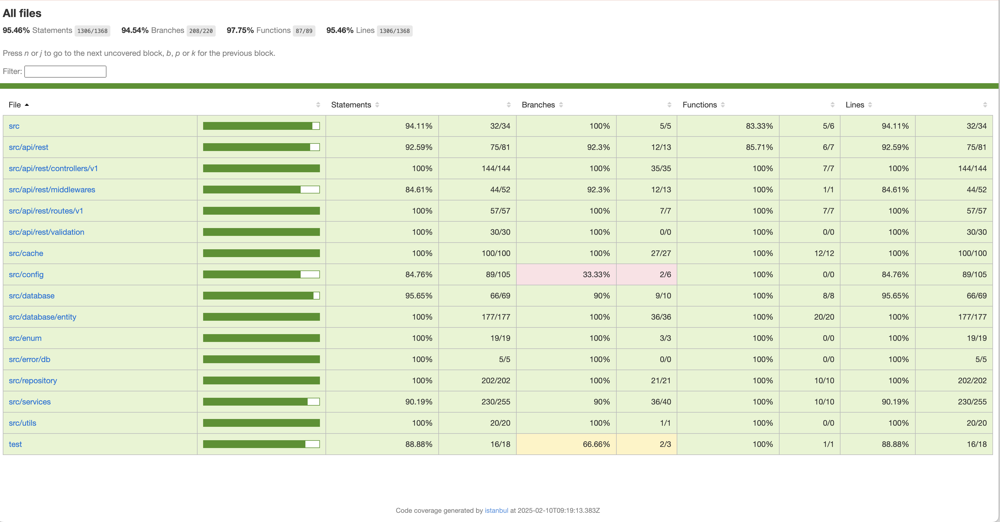

# Great Brands Booking System

## Postman API Document
- [Document](https://documenter.getpostman.com/view/16722310/2sAYX9mzyZ)
- Variable:
  - `{{BASE_API_URL_V1}}` = `http://localhost:3000/api/v1`

## Tools
- node
- package manager (npm | yarn)
- Database: Postgres
- Docker Engine

## Development Setup
The application can be run on both host machine and in a containerised environment

## Environment Variables
- Rename `.env.sample` to `.env`
- Update the `.env` with valid variable values
- Rename `db.env.sample` to `db.env`
- Update the `db.env` with valid database values

## Run the application on host machine
- Make sure postgres credentials has been set in `.env` file
- Run `npm install` | `yarn install`
- Run build: `npm run build` | `yarn run build`
- Start the server: `npm run start` | `yarn run start`

## Run the application in docker (Recommended)
- Run `docker compose up --build app db`

## Run Tests
- Fill `.env` with test data
- Make sure test database is up and running
  - To start a test database in docker run `docker compose up test-db`.
  - This port forward to `localhost` on PORT `5433`
- Run `npm run test` | `yarn run test`

### Test Coverage

  

## Authentication

### Schema
- Basic Authentication
  - `Authorization: Basic base64(username:password)`

## Implementation Description
- An authenticated user can create an event
- An authenticated user can book multiple tickets for an event (to ease testing the main functionality)

### /book
- Uses transaction to ensure all database operations are atomic
- Fetches the event using `pessimistic write` lock to prevent concurrent modifications
- Checks the event availability
- Books the ticket:
  - Creates a new booking entry
  - Decrements the `available_tickets` count for the event
- If no tickets ae available:
  - It creates a new `wailist` entry for the user

### /cancel
- Uses transaction to ensure all database operations are atomic
- Fetch the booking using the bookId and ensure it is in the `BOOKED` status
- If the booking does not exist or does not belong to the user, return and error.
- Update the booking status to `CANCELLED`.
- Handle wait list. Fetch the next user on the waitlist for the event
  - If a user is on the wait list:
    - Create a new booking for the waitlist user
    - Remove the wait list entry
  - If no user is on the wait list:
    - Increment the available ticket count for the event

### Summary
- Transactions:
  - Both methods use transactions to ensure atomicity and consistency.
  - If any operation fails, the entire transaction is rolled back.
- Locking:
  - The `book` method uses a `pessimistic write` lock to prevent concurrent modifications to the event.
- Error Handling:
  - Both methods handle errors gracefully, returning appropriate error messages and statuses.
- Waitlist Management:
  - The `cancel` method ensures that canceled tickets are either returned to the pool or assigned to the next user on the waitlist.
